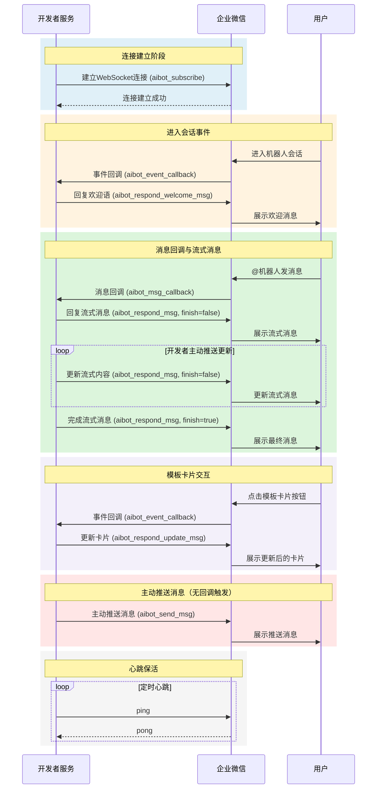
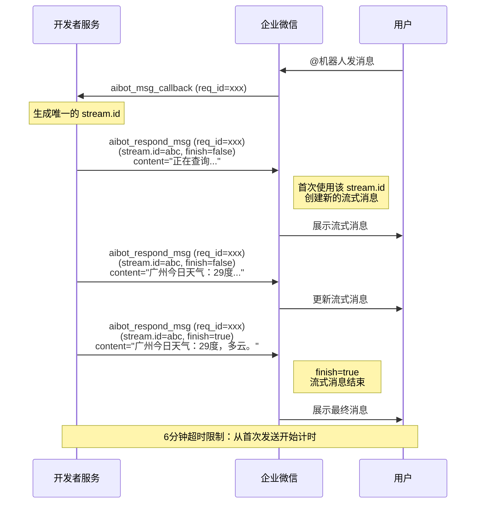

# 企业微信智能机器人长连接 (WebSocket) API 参考

> 本文档整理自企业微信官方 API 文档（doc_id: 60904），供开发时参考。

## 概述

企业微信智能机器人支持通过 WebSocket 长连接接收消息回调和回复消息，无需公网 IP，无需消息加解密，延迟更低。

**WebSocket 地址**: `wss://openws.work.weixin.qq.com`

**连接限制**: 每个机器人同一时间只能保持一个有效长连接，新连接会踢掉旧连接。

### 官方 SDK

| 语言 | 下载地址 |
|------|----------|
| Node.js | [aibot-node-sdk](https://www.npmjs.com/package/@wecom/aibot-node-sdk) |
| Python | [aibot-python-sdk](https://dldir1.qq.com/wework/wwopen/bot/aibot-python-sdk-1.0.0.zip) |

### 长连接与短连接（Webhook）方式对比

| 特性 | Webhook（短连接） | WebSocket（长连接） |
|------|-------------------|---------------------|
| 连接方式 | 每次回调建立新连接 | 复用已建立的长连接 |
| 延迟 | 较高（每次需建连） | 低（复用连接） |
| 实时性 | 一般 | 好 |
| 服务端要求 | 需要公网可访问的 URL | 无需固定的公网 IP |
| 加解密 | 需要对消息加解密 | 无需加解密 |
| 复杂度 | 低 | 较高（需维护心跳） |
| 可靠性 | 高（无状态） | 需要心跳保活、断线重连 |
| 适用场景 | 普通回调场景 | 高实时性要求、无固定公网 IP 场景 |

### 适用场景

推荐使用 WebSocket 长连接方式的场景：
- **无公网 IP**：开发者服务部署在内网环境，无法配置公网可访问的回调 URL
- **高实时性要求**：需要更低的消息延迟
- **简化开发**：无需处理消息加解密逻辑

## 凭证

| 凭证 | 说明 |
|------|------|
| BotID | 智能机器人唯一标识 |
| Secret | 长连接专用密钥（非 Webhook 的 Token/AESKey） |

在企微管理后台 → 智能机器人 → API 模式 → 长连接 中获取。

> **注意**：模式切换影响 — API 模式只能选择一种方式（长连接或设置接收消息回调地址），切换会导致另一种模式的配置失效。

---

## 通信协议

所有消息均为 JSON 格式，通过 `cmd` 字段区分命令类型，通过 `headers.req_id` 关联请求与响应。

### 命令类型一览

| cmd | 方向 | 说明 |
|-----|------|------|
| `aibot_subscribe` | 开发者 → 企微 | 订阅（身份校验） |
| `aibot_msg_callback` | 企微 → 开发者 | 用户消息回调 |
| `aibot_event_callback` | 企微 → 开发者 | 事件回调（进入会话、卡片点击、反馈、断连） |
| `aibot_respond_msg` | 开发者 → 企微 | 回复消息（支持流式） |
| `aibot_respond_welcome_msg` | 开发者 → 企微 | 回复欢迎语 |
| `aibot_respond_update_msg` | 开发者 → 企微 | 更新模板卡片 |
| `aibot_send_msg` | 开发者 → 企微 | 主动推送消息 |
| `aibot_upload_media_init` | 开发者 → 企微 | 上传临时素材 — 初始化 |
| `aibot_upload_media_chunk` | 开发者 → 企微 | 上传临时素材 — 分片上传 |
| `aibot_upload_media_finish` | 开发者 → 企微 | 上传临时素材 — 完成上传 |
| `ping` | 开发者 → 企微 | 心跳保活 |

### 统一响应格式

所有命令的响应结构一致：

```json
{
    "headers": { "req_id": "REQUEST_ID" },
    "errcode": 0,
    "errmsg": "ok"
}
```

---

## 整体交互流程



**流程说明：**

1. **连接建立阶段**：使用 BotID 和 Secret 发起 WebSocket 连接请求（aibot_subscribe），连接建立成功后保持长连接状态
2. **进入会话事件**：用户首次进入机器人单聊会话时，推送事件回调（aibot_event_callback），开发者可回复欢迎语
3. **消息回调与流式消息**：用户 @机器人 或单聊发消息时，推送消息回调。长连接模式下不再有流式刷新回调，开发者需主动推送流式更新内容
4. **模板卡片交互**：用户点击模板卡片按钮时推送事件回调，开发者可更新卡片内容
5. **主动推送消息**：开发者可在没有用户消息触发的情况下，通过 `aibot_send_msg` 主动推送消息
6. **心跳保活**：定期发送心跳（ping）保持连接活跃，建议间隔 30 秒

---

## 1. 建立连接 (aibot_subscribe)

WebSocket 握手成功后，发送订阅请求进行身份校验。订阅成功后不要反复请求，有频率保护。

**请求：**

```json
{
    "cmd": "aibot_subscribe",
    "headers": { "req_id": "唯一请求ID" },
    "body": {
        "bot_id": "BOTID",
        "secret": "SECRET"
    }
}
```

| 字段 | 类型 | 必填 | 说明 |
|------|------|------|------|
| cmd | string | 是 | 固定值 `aibot_subscribe` |
| headers.req_id | string | 是 | 请求唯一标识，由开发者自行生成 |
| body.bot_id | string | 是 | 智能机器人的 BotID |
| body.secret | string | 是 | 长连接专用密钥 Secret |

---

## 2. 接收消息回调 (aibot_msg_callback)

用户 @机器人 或单聊发消息时，企微推送此回调。

**推送格式（文本消息示例）：**

```json
{
    "cmd": "aibot_msg_callback",
    "headers": { "req_id": "REQUEST_ID" },
    "body": {
        "msgid": "MSGID",
        "aibotid": "AIBOTID",
        "chatid": "CHATID",
        "chattype": "group",
        "from": { "userid": "USERID" },
        "msgtype": "text",
        "text": { "content": "@RobotA hello robot" }
    }
}
```

| 字段 | 类型 | 说明 |
|------|------|------|
| cmd | string | 固定值 `aibot_msg_callback` |
| headers.req_id | string | 请求唯一标识，回复消息时需透传 |
| body.msgid | string | 消息唯一标识，用于排重 |
| body.aibotid | string | 智能机器人 BotID |
| body.chatid | string | 会话 ID，仅群聊类型时返回 |
| body.chattype | string | 会话类型，`single` 单聊 / `group` 群聊 |
| body.from.userid | string | 消息发送者的 userid |
| body.msgtype | string | 消息类型 |

### 支持的消息类型

| msgtype | 说明 | 限制 |
|---------|------|------|
| `text` | 文本消息 | - |
| `image` | 图片消息 | 仅单聊 |
| `mixed` | 图文混排 | - |
| `voice` | 语音消息（转为文本） | 仅单聊 |
| `file` | 文件消息 | 仅单聊 |
| `video` | 视频消息 | 仅单聊 |

### 多媒体资源解密

长连接模式下，`image`、`file` 和 `video` 结构体中会额外返回解密密钥 `aeskey`，用于解密下载的资源文件。

**图片结构体示例：**

```json
{
    "image": {
        "url": "URL",
        "aeskey": "AESKEY"
    }
}
```

**文件结构体示例：**

```json
{
    "file": {
        "url": "URL",
        "aeskey": "AESKEY"
    }
}
```

**视频结构体示例：**

```json
{
    "video": {
        "url": "URL",
        "aeskey": "AESKEY"
    }
}
```

| 字段 | 类型 | 说明 |
|------|------|------|
| url | string | 资源下载地址，**5 分钟内有效** |
| aeskey | string | 解密密钥，每个下载链接的 aeskey 唯一 |

> **解密方式**：AES-256-CBC，数据采用 PKCS#7 填充至 32 字节的倍数，IV 初始向量大小为 16 字节，取 aeskey 前 16 字节。

---

## 3. 接收事件回调 (aibot_event_callback)

用户与智能机器人发生交互时，企微推送事件回调。

**推送格式（进入会话事件示例）：**

```json
{
    "cmd": "aibot_event_callback",
    "headers": { "req_id": "REQUEST_ID" },
    "body": {
        "msgid": "MSGID",
        "create_time": 1700000000,
        "aibotid": "AIBOTID",
        "chatid": "CHATID",
        "chattype": "single",
        "from": { "userid": "USERID" },
        "msgtype": "event",
        "event": { "eventtype": "enter_chat" }
    }
}
```

| 字段 | 类型 | 说明 |
|------|------|------|
| cmd | string | 固定值 `aibot_event_callback` |
| headers.req_id | string | 请求唯一标识，回复消息时需透传 |
| body.msgid | string | 唯一标识，用于事件排重 |
| body.create_time | int | 事件产生的时间戳 |
| body.aibotid | string | 智能机器人 BotID |
| body.chatid | string | 会话 ID，仅群聊类型时返回 |
| body.chattype | string | 会话类型，`single` 单聊 / `group` 群聊 |
| body.from.userid | string | 事件触发者的 userid |
| body.msgtype | string | 固定为 `event` |
| body.event.eventtype | string | 事件类型 |

### 支持的事件类型

| eventtype | 说明 |
|-----------|------|
| `enter_chat` | 用户当天首次进入机器人单聊会话 |
| `template_card_event` | 用户点击模板卡片按钮 |
| `feedback_event` | 用户对机器人回复进行反馈 |
| `disconnected_event` | 新连接建立导致旧连接被踢掉 |

**连接断开事件示例：**

```json
{
    "cmd": "aibot_event_callback",
    "headers": { "req_id": "REQUEST_ID" },
    "body": {
        "msgid": "MSGID",
        "create_time": 1700000000,
        "aibotid": "AIBOTID",
        "msgtype": "event",
        "event": { "eventtype": "disconnected_event" }
    }
}
```

---

## 4. 回复欢迎语 (aibot_respond_welcome_msg)

收到 `enter_chat` 事件后，**5 秒内**回复欢迎语。仅适用于进入会话事件。

**请求：**

```json
{
    "cmd": "aibot_respond_welcome_msg",
    "headers": { "req_id": "透传事件回调的req_id" },
    "body": {
        "msgtype": "text",
        "text": { "content": "您好！我是智能助手，有什么可以帮您的吗？" }
    }
}
```

| 字段 | 类型 | 必填 | 说明 |
|------|------|------|------|
| cmd | string | 是 | 固定值 `aibot_respond_welcome_msg` |
| headers.req_id | string | 是 | 透传事件回调中的 req_id |
| body | object | 是 | 消息内容 |

---

## 5. 回复消息 (aibot_respond_msg)

收到 `aibot_msg_callback` 后回复。**24 小时内**可回复。

**频率限制**：无论是回复还是主动推送消息，总共给某个会话发消息的限制为 **30 条/分钟，1000 条/小时**。

### 流式消息机制

流式消息的发送和刷新通过 `stream.id` 进行关联：

- **发送流式消息**：首次使用某个 `stream.id` 回复时，创建一条新的流式消息
- **刷新流式消息**：继续使用相同的 `stream.id` 推送时，更新该流式消息的内容
- **完成流式消息**：设置 `finish=true` 结束流式消息，不可再更新
- **超时**：从首次发送起 **6 分钟内**必须完成所有刷新并设置 `finish=true`

**关键区别**：长连接模式下，开发者**主动推送**流式更新（不同于 Webhook 模式的回调轮询）。所有回复使用同一个 `req_id`（消息回调中的）。



**请求示例（流式消息回复）：**

```json
{
    "cmd": "aibot_respond_msg",
    "headers": { "req_id": "透传消息回调的req_id" },
    "body": {
        "msgtype": "stream",
        "stream": {
            "id": "自定义唯一stream_id",
            "finish": false,
            "content": "正在为您查询天气信息..."
        }
    }
}
```

| 字段 | 类型 | 必填 | 说明 |
|------|------|------|------|
| cmd | string | 是 | 固定值 `aibot_respond_msg` |
| headers.req_id | string | 是 | 透传消息回调中的 req_id |
| body | object | 是 | 消息内容（支持流式消息、模板卡片、markdown、文件、图片、语音、视频） |

> **注意**：目前暂不支持 msg_item 字段。长连接模式下不支持流式消息+模板卡片的组合消息。

---

## 6. 更新模板卡片 (aibot_respond_update_msg)

收到 `template_card_event` 事件后，**5 秒内**更新卡片。仅适用于模板卡片点击事件。

**请求：**

```json
{
    "cmd": "aibot_respond_update_msg",
    "headers": { "req_id": "透传事件回调的req_id" },
    "body": {
        "response_type": "update_template_card",
        "template_card": {
            "card_type": "button_interaction",
            "main_title": { "title": "xx系统告警", "desc": "服务器CPU使用率超过90%" },
            "button_list": [
                { "text": "确认中", "style": 1, "key": "confirm" },
                { "text": "误报", "style": 2, "key": "false_alarm" }
            ],
            "task_id": "TASK_ID",
            "feedback": { "id": "FEEDBACKID" }
        }
    }
}
```

| 字段 | 类型 | 必填 | 说明 |
|------|------|------|------|
| cmd | string | 是 | 固定值 `aibot_respond_update_msg` |
| headers.req_id | string | 是 | 透传事件回调中的 req_id |
| body | object | 是 | 消息内容 |

---

## 7. 主动推送消息 (aibot_send_msg)

无需用户触发，主动向用户或群聊推送消息。适用于定时提醒、异步任务通知、告警推送等场景。

**前提条件**：需要用户在会话中给机器人发过消息，后续机器人才能主动推送消息给对应会话。

**频率限制**：30 条/分钟，1000 条/小时（与回复共享配额）。

**请求示例（markdown 消息）：**

```json
{
    "cmd": "aibot_send_msg",
    "headers": { "req_id": "自定义唯一请求ID" },
    "body": {
        "chatid": "CHATID",
        "chat_type": 1,
        "msgtype": "markdown",
        "markdown": { "content": "这是一条**主动推送**的消息" }
    }
}
```

| 字段 | 类型 | 必填 | 说明 |
|------|------|------|------|
| cmd | string | 是 | 固定值 `aibot_send_msg` |
| headers.req_id | string | 是 | 请求唯一标识，由开发者自行生成 |
| body.chatid | string | 是 | 会话 ID。单聊填用户的 userid，群聊填对应群聊回调事件中获取的 chatid |
| body.chat_type | uint32 | 否 | 会话类型：`1` 单聊（userid）；`2` 群聊；`0` 或不填自动判断（优先群聊） |
| body.msgtype | string | 是 | 消息类型 |

### 支持的消息类型

| msgtype | 说明 |
|---------|------|
| `template_card` | 模板卡片消息（仅单聊） |
| `markdown` | Markdown 格式消息 |
| `file` | 文件消息 |
| `image` | 图片消息 |
| `voice` | 语音消息 |
| `video` | 视频消息 |

---

## 8. 消息类型格式说明

### Markdown 消息

```json
{
    "msgtype": "markdown",
    "markdown": {
        "content": "# 标题\n**加粗** *斜体*\n- 列表项\n> 引用\n[链接](https://example.com)",
        "feedback": { "id": "FEEDBACKID" }
    }
}
```

| 参数 | 类型 | 必填 | 说明 |
|------|------|------|------|
| msgtype | String | 是 | 固定为 `markdown` |
| markdown.content | String | 是 | 消息内容，最长不超过 20480 字节，必须是 utf8 编码 |
| markdown.feedback.id | String | 否 | 若不为空，用户反馈时触发回调事件。256 字节以内，utf-8 编码 |

### 模板卡片消息

```json
{
    "msgtype": "template_card",
    "template_card": {
        "card_type": "button_interaction",
        "feedback": { "id": "FEEDBACKID" }
    }
}
```

| 参数 | 类型 | 必填 | 说明 |
|------|------|------|------|
| msgtype | String | 是 | 固定为 `template_card`。仅单聊时支持 |
| template_card | Object | 是 | 模板卡片结构体 |
| template_card.feedback.id | String | 否 | 若不为空，用户反馈时触发回调事件 |

### 文件消息

```json
{
    "msgtype": "file",
    "file": { "media_id": "MEDIA_ID" }
}
```

| 参数 | 必填 | 说明 |
|------|------|------|
| msgtype | 是 | 固定为 `file` |
| media_id | 是 | 文件 id，通过上传临时素材接口获取 |

### 图片消息

```json
{
    "msgtype": "image",
    "image": { "media_id": "MEDIA_ID" }
}
```

| 参数 | 必填 | 说明 |
|------|------|------|
| msgtype | 是 | 固定为 `image` |
| media_id | 是 | 图片媒体文件 id，通过上传临时素材接口获取 |

### 语音消息

```json
{
    "msgtype": "voice",
    "voice": { "media_id": "MEDIA_ID" }
}
```

| 参数 | 必填 | 说明 |
|------|------|------|
| msgtype | 是 | 固定为 `voice` |
| media_id | 是 | 语音文件 id，通过上传临时素材接口获取 |

### 视频消息

```json
{
    "msgtype": "video",
    "video": {
        "media_id": "MEDIA_ID",
        "title": "Title",
        "description": "Description"
    }
}
```

| 参数 | 必填 | 说明 |
|------|------|------|
| msgtype | 是 | 固定为 `video` |
| media_id | 是 | 视频媒体文件 id，通过上传临时素材接口获取 |
| title | 否 | 视频标题，不超过 64 字节，超过自动截断 |
| description | 否 | 视频描述，不超过 512 字节，超过自动截断 |

---

## 9. 心跳保活 (ping)

连接建立成功后，需定期发送心跳保持连接活跃。建议每 **30 秒**发送一次，长时间无心跳会被服务端主动断连。

**请求：**

```json
{
    "cmd": "ping",
    "headers": { "req_id": "唯一请求ID" }
}
```

---

## 10. 上传临时素材

长连接模式支持通过分片方式上传临时素材，用于发送文件、图片、语音、视频消息。上传流程分为三步。

**约束**：
- 上传会话有效期 **30 分钟**，超时自动清理
- 单个分片不超过 **512KB**（Base64 编码前），最多 **100** 个分片
- 分片可乱序上传，重复上传同一分片自动忽略（幂等）
- 上传的临时素材有效期 **3 天**
- 频率限制：单个机器人 30 次/分钟，1000 次/小时
- 文件大小限制：图片/语音 ≤ 2MB，视频 ≤ 10MB，普通文件 ≤ 20MB
- 图片支持 png、jpg/jpeg、gif；语音支持 amr；视频支持 mp4

### 10.1 上传初始化 (aibot_upload_media_init)

```json
{
    "cmd": "aibot_upload_media_init",
    "headers": { "req_id": "REQUEST_ID" },
    "body": {
        "type": "file",
        "filename": "test.pdf",
        "total_size": 2333,
        "total_chunks": 124,
        "md5": "文件md5值"
    }
}
```

| 字段 | 类型 | 必填 | 说明 |
|------|------|------|------|
| body.type | string | 是 | 文件类型：`file`、`image`、`voice`、`video` |
| body.filename | string | 是 | 文件名，不超过 256 字节 |
| body.total_size | int | 是 | 文件总大小（字节），最少 5 字节 |
| body.total_chunks | int | 是 | 分片数量，不超过 100 |
| body.md5 | string | 否 | 文件 md5，服务端合并后校验完整性 |

**响应：**

```json
{
    "headers": { "req_id": "REQUEST_ID" },
    "body": { "upload_id": "UPLOADID" },
    "errcode": 0,
    "errmsg": "ok"
}
```

### 10.2 上传分片 (aibot_upload_media_chunk)

```json
{
    "cmd": "aibot_upload_media_chunk",
    "headers": { "req_id": "REQUEST_ID" },
    "body": {
        "upload_id": "UPLOADID",
        "chunk_index": 0,
        "base64_data": "Base64编码的分片数据"
    }
}
```

| 字段 | 类型 | 必填 | 说明 |
|------|------|------|------|
| body.upload_id | string | 是 | 初始化时返回的上传 id |
| body.chunk_index | int | 是 | 分片序号，从 0 开始 |
| body.base64_data | string | 是 | 分片内容经 base64 encode 后的数据 |

### 10.3 上传结束 (aibot_upload_media_finish)

```json
{
    "cmd": "aibot_upload_media_finish",
    "headers": { "req_id": "REQUEST_ID" },
    "body": { "upload_id": "UPLOADID" }
}
```

**响应：**

```json
{
    "headers": { "req_id": "REQUEST_ID" },
    "body": {
        "type": "file",
        "media_id": "MEDIA_ID",
        "created_at": "1380000000"
    },
    "errcode": 0,
    "errmsg": "ok"
}
```

| 字段 | 类型 | 说明 |
|------|------|------|
| body.type | string | 文件类型 |
| body.media_id | string | 媒体文件唯一标识，**3 天内有效** |
| body.created_at | int | 上传时间戳 |

---

## 关键约束速查

| 约束 | 值 |
|------|------|
| 同一机器人最大连接数 | 1 |
| 欢迎语/卡片更新超时 | 5 秒 |
| 流式消息超时 | 6 分钟 |
| 回复消息时效 | 24 小时 |
| 会话发送频率 | 30 条/分钟，1000 条/小时 |
| 心跳间隔 | 建议 30 秒 |
| 临时素材有效期 | 3 天 |
| 上传会话有效期 | 30 分钟 |
| 单个分片大小 | ≤ 512KB（Base64 编码前） |
| 最大分片数 | 100 |
| 上传频率 | 30 次/分钟，1000 次/小时 |

## 典型消息处理流程

```
收到 WebSocket 消息
  ├── cmd = "aibot_msg_callback"
  │     ├── 提取 req_id, from.userid, chattype, msgtype, content
  │     ├── 业务处理（AI 推理等）
  │     └── 通过 aibot_respond_msg 回复（可流式）
  ├── cmd = "aibot_event_callback"
  │     ├── eventtype = "enter_chat" → aibot_respond_welcome_msg
  │     ├── eventtype = "template_card_event" → aibot_respond_update_msg
  │     ├── eventtype = "feedback_event" → 记录反馈
  │     └── eventtype = "disconnected_event" → 触发重连
  └── errcode 响应 → 匹配 req_id 处理结果
```
